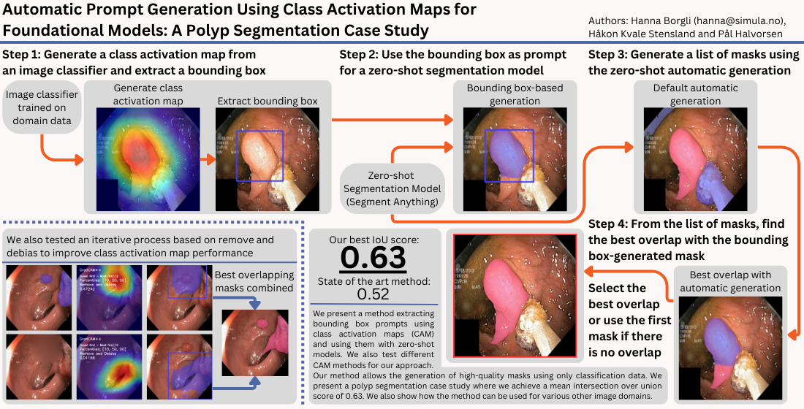

## Code repository for:
# Automatic Prompt Generation Using Class Activation Maps for Foundational Models: A Polyp Segmentation Case Study

### Abstract:
We introduce a weakly supervised segmentation approach that leverages class activation maps and the Segment Anything Model to generate high-quality masks using only classification data. A pre-trained classifier produces class activation maps that, once thresholded, yield bounding boxes encapsulating the regions of interest. These boxes prompt the SAM to generate detailed segmentation masks, which are then refined by selecting the best overlap with automatically generated masks from the foundational model using the intersection over union metric. In a polyp segmentation case study, our approach outperforms existing zero-shot and weakly supervised methods, achieving a mean intersection over union of 0.63. This method offers an efficient and general solution for image segmentation tasks where segmentation data are scarce.



---

##  Code Documentation
The code is split into each experiment file which runs independently of each other.

### Requirements
- Python 3.12.3
- Pytorch and torchvision
- A trained image classifier. We use the one from the [GastroVision](https://github.com/DebeshJha/GastroVision). Set the class target to the class of interest.
- Set the paths to the classifier and the dataset in the experiment files.

#### experiment1: 
This script uses the SAM model to automatically generate segmentation masks from input images and evaluates them by computing the Intersection over Union (IoU) against ground truth masks. The raw masks are saved as numpy arrays, and annotated overlay images are generated for visual inspection.

#### experiment2:
This script utilizes the Microsoft Florence-2-base model for referring expression segmentation to detect polyps in images. It generates segmentation masks from a text prompt, overlays them on the original images, and calculates evaluation metrics (IoU Binary and IoU Micro) by comparing the generated masks with ground truth masks.

#### experiment3:
This script integrates the SAM model with CLIP-based filtering to generate and evaluate segmentation masks on images. It automatically downloads the SAM checkpoint if not available, adjusts image sizes, filters masks using a textual query, and computes IoU scores against ground truth masks.

#### experiment4:
This script applies the LangSAM model for polyp segmentation in colon images. It processes images by generating segmentation masks, bounding boxes, and detected phrases based on a descriptive text prompt, then filters and evaluates the masks against ground truth.

#### experiment5:
This script performs hyperparameter tuning for generating segmentation masks using GradCAM methods. It integrates a mobile SAM predictor and an image classifier to generate class activation maps (CAMs), then optimizes parameters via scikit-optimize by evaluating the generated masks against ground truth.

#### experiment6:
This script tests the overlay of segmentation masks generated by combining GradCAM-based visualizations with SAM predictions. It computes evaluation metrics—including IoU and ROAD metrics—by comparing generated masks against ground truth masks, and saves detailed results for further analysis.


Please cite the paper if using any of this work.

Bib citation:
```
@article{borgli2025automatic,
    title={Automatic Prompt Generation Using Class Activation Maps for Foundational Models: A Polyp Segmentation Case Study},
    author={Borgli, Hanna and Stensland, H{\aa}kon Kvale and Halvorsen, P{\aa}l},
    journal={Machine Learning and Knowledge Extraction (MAKE)},
    volume={7},
    number={1},
    article-number={22},
    year={2025},
    ISSN = {2504-4990},
    publisher={Multidisciplinary Digital Publishing Institute (MDPI)},
    doi={10.3390/make7010022}
}
```
